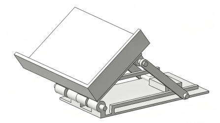

# 基于叶素原理的回旋镖运动轨迹相关参数的研究

**作者：** 金浩楠 
**机构：** 南京航空航天大学  

## 摘要
作为具有独特“返回原点”特性的飞行装置，回旋镖的飞行轨迹涉及低雷诺数下非定常气动力与刚体姿态动力学的复杂耦合。本文以叶素理论为基础，融合欧拉角姿态描述与牛顿-欧拉运动方程，构建了完整的三翼回旋镖运动模型。借助“z-x-z”欧拉角旋转约定建立坐标系转换关系，系统推导了升力、滚转力矩等关键气动力公式，重点分析了旋转气流周期性反转对气动特性的影响。利用Matlab仿真不同尖速比与章动角下的飞行轨迹，提取轨迹形态、飞行时间等指标，进而定量揭示参数对轨迹及稳定性的调控机制。在此基础上，设计高速摄像实验，通过双摄像机同步拍摄与图像识别技术获取实际飞行轨迹数据，对比仿真与实测结果验证了模型的有效性。本研究既为三翼回旋镖的结构优化与运动预测提供了理论支撑，也深化了对低雷诺数下旋转刚体与非定常气动力耦合机理的认识，对相关飞行器设计控制具有重要参考价值。

## 关键词
回旋镖；叶素原理；进动；角动量；运动轨迹；不对称升力

## 引言
回旋镖作为一种兼具历史文化价值与工程力学特性的装置，其起源可追溯至数万年前的澳洲土著文明。最初，澳洲土著将木质回旋镖用作狩猎工具，而当回旋镖未击中目标时，其独特的动力学特性使其能自动返回投掷者手中，这种“回旋”的现象是回旋镖最显著的标志。随着时代发展，回旋镖的功能逐渐从工具转向娱乐与竞技，如今已成为全球流行的户外运动器材，衍生出最长飞行时间、最远返回距离等多项竞技项目，其背后蕴含的空气动力学与刚体力学耦合机制，也成为流体力学与运动力学交叉领域的研究热点。

20世纪60年代，Felix Hess首次建立了回旋镖的简化气动模型，提出“升力与角速度平方成正比、滚转力矩与角速度和平动速度的乘积成正比”的经验关系，但该模型无法实现自配平，且稳定性分析存在局限性[1]。2012年，John C. Vassberg将叶素理论（Blade Element Theory, BET）引入回旋镖研究，通过离散叶片微元、计算每个微元的气动力并积分，建立了更贴合实际的气动模型，首次揭示了回旋镖动态稳定性的内在机制[2]。同时，Prasad S. Gudem等发现了回旋镖飞行过程中的气流和攻角反转现象[3]。Azuma等建立回飞棒严格非线性运动方程，结合叶片元理论，揭示其长短周期振荡机制，及气动向心力与自旋陀螺效应的回飞原理[2]；Beppu等分析初始条件与几何参数影响，明确可飞行的折叠角范围，验证网球拍效应增强稳定性[2]。然而，国内现有研究多聚焦于传统V型双叶回旋镖，且针对影响回旋镖运动的相关参数的系统性研究仍有待补充[7]。

## 1 回旋镖的回旋原理

图1 回旋镖模型图  
Fig.1 Boomerang Model Diagram

回旋镖的叶片采用类飞机机翼的翼型设计（图1），其典型特征为前缘钝、后缘锐，部分设计还带有正弯度以在特定迎角下产生更大的升力。当回旋镖被抛出时，其运动可分解为两部分：一是绕通过质心的旋转轴进行的高速自转；二是质心沿飞行轨迹的平动。这两种运动的叠加，会使叶片不同位置与空气的相对速度产生显著差异，进而产生不对称升力。

以图2的三翼回旋镖为例进行分析，设 $V$ 为回旋镖质心飞行速度的大小，且其自转方向垂直纸面向外。叶片上任意一点到质心的距离为 $r$，则该点因自转产生的线速度大小为 $r\dot{\psi}$，方向沿叶片切线方向。因此，前进侧（即叶片旋转方向与飞行方向相同的一侧）的相对风速为自转线速度与平动速度之和，即 $V_n = V + r\dot{\psi}\cos(\theta)$；而在后退侧（即叶片旋转方向与飞行方向相反的一侧），相对风速为两者之差，即 $V_n = V - r\dot{\psi}\cos(\theta)$。

作用在叶片上的升力可由升力公式表示[1]：
$$ F_{lift} = \frac{1}{2} \rho A C_L V_n^2 \tag{1} $$
式中：
-  $\rho$  为空气密度；
- $C_L$ 为升力系数；
- $A$ 为翼型面积；
- $V_n$ 为叶片相对于风的速度。

由公式(1)可知，升力与速度的平方成正比，前进侧因速度较大产生的升力显著大于后退侧，最终形成驱动回旋镖运动的不对称升力。

图2 不对称升力的产生  
Fig.2 The generation of asymmetric lift

该不对称升力对回旋镖质心形成一个滚转力矩，如图3所示，力矩的方向垂直于回旋镖的自转角动量。根据陀螺进动原理[1]，该力矩会导致角动量的方向随时间偏转，即回旋镖的自转轴绕惯性系的竖直轴做进动，进动角速度与滚转力矩成正比。随着进动的持续，回旋镖的飞行方向逐渐偏转，最终形成闭合的圆周轨迹，实现返回。

图3 回旋镖的回旋原理[7]  
Fig.3 The principle of the boomerang's spin

## 2 回旋镖运动模型的建立

在常规飞行条件下，回旋镖因气动载荷产生的弹性变形通常远小于其整体运动尺度。基于此特征，在研究其宏观运动轨迹与姿态动力学特性时，可将其合理简化为刚体模型。该简化假设为刚体运动学与动力学理论应用于其回旋机理分析奠定了基础。下面基于欧拉角姿态描述、牛顿-欧拉运动方程及叶素原理，逐步构建回旋镖的运动力学模型。

### 2.1 欧拉坐标系与姿态转换

回旋镖在飞行中姿态不断变化，需通过欧拉角描述其在惯性系中的姿态，设惯性系为 $X'$，随回旋镖飞行的体坐标系为 $X$，惯性系 $o-x'y'z'$ 到体坐标系 $o-xyz$ 的转换，采用 $z-x-z$ 旋转约定，即先绕 $z'$ 轴旋转、再绕 $x'$ 轴旋转、最后绕体坐标系的 $z$ 轴旋转。

为实现惯性系与体坐标系间的速度、力矩转换，需构建转换矩阵 $T$。根据 $z-x-z$ 旋转约定，转换过程分为三步：第一步绕 $z'$ 轴旋转 $\phi$ 角，旋转矩阵 $A$ 为：
$$ A = \begin{bmatrix} \cos\phi & \sin\phi & 0 \\ -\sin\phi & \cos\phi & 0 \\ 0 & 0 & 1 \end{bmatrix} \tag{2} $$

绕第一步旋转后的 $x'$ 轴旋转 $\theta$ 角，旋转矩阵 $B$：
$$ B = \begin{bmatrix} 1 & 0 & 0 \\ 0 & \cos\theta & \sin\theta \\ 0 & -\sin\theta & \cos\theta \end{bmatrix} \tag{3} $$

最后绕体坐标系 $z$ 轴旋转 $\psi$ 角，旋转矩阵 $C$：
$$ C = \begin{bmatrix} \cos\psi & \sin\psi & 0 \\ -\sin\psi & \cos\psi & 0 \\ 0 & 0 & 1 \end{bmatrix} \tag{4} $$

如图4所示，这三个旋转共同描述了回旋镖在空中飞行时的方位。由此可得两个坐标系之间的转换关系为 $X = CBAX'$，设 $T = CBA$，则：
$$ T = \begin{bmatrix} \cos\phi\cos\psi\sin\theta + \sin\phi\sin\psi\cos\theta & \cos\phi\sin\psi\sin\theta - \sin\phi\cos\psi\cos\theta & \cos\phi\cos\theta \\ \sin\phi\cos\psi\sin\theta - \cos\phi\sin\psi\cos\theta & \sin\phi\sin\psi\sin\theta + \cos\phi\cos\psi\cos\theta & \sin\phi\cos\theta \\ -\sin\theta & \cos\theta & 0 \end{bmatrix} \tag{5} $$

上式即为 $X'$ 、$X$ 之间的转换矩阵。

由于旋转矩阵为正交矩阵，故体坐标系到惯性系的转换矩阵 $T'$ 为 $T$ 的转置。该矩阵的核心作用是将惯性系中的外力矩、角速度等物理量映射到体坐标系中，为后续运动方程的建立奠定基础。

### 2.2 运动方程

回旋镖的运动是质心平动与绕质心转动的叠加。其独特的轨迹源于转动与平动之间的气动耦合效应，即转动姿态直接影响了其所受的气动力，从而主导了质心的运动轨迹。因此，下面将重点分析与转动相关的动力学，即建立并求解欧拉运动方程。

首先利用式(5)给出的转换矩阵，将三个欧拉角对应的角速度矢量从惯性系映射至体坐标系，对各分量进行叠加合成后，推导得到描述两坐标系间运动关系的欧拉运动方程如下：
$$ \begin{cases} \dot{\omega}_x = \dot{\phi}\sin\theta\cos\psi + \dot{\theta}\cos\phi\sin\psi \\ \dot{\omega}_y = \dot{\phi}\sin\theta\sin\psi - \dot{\theta}\cos\phi\cos\psi \\ \dot{\omega}_z = \dot{\phi}\cos\theta + \dot{\theta}\sin\phi \end{cases} \tag{6} $$

式中：
- $\omega_x$ $、$ $\omega_y$ $、$ $\omega_z$ 分别为体坐标系 $x$ $、$$y$ $、$ $z$ 方向的角速率。该方程将惯性系中的姿态变化率 $[\dot{\phi}, \dot{\theta}, \dot{\psi}]^T$ 转化为体坐标系下的姿态变化率 $[\omega_x, \omega_y, \omega_z]^T$，为后续力矩与角加速度的关联提供桥梁。

牛顿-欧拉方程描述了外力矩与角加速度的关系。在回旋镖的惯性系中，基于 $z-x-z$ 旋转约定可得所受力矩和角加速度之间的关系如下：
$$ \begin{cases} M_x = I_{xx}\ddot{\phi} + (I_{yy} - I_{zz})\dot{\theta}\dot{\psi}\sin\theta\cos\psi + (I_{zz} - I_{xx})\dot{\theta}\dot{\psi}\sin\theta\sin\psi \\ M_y = I_{yy}\ddot{\theta} + (I_{zz} - I_{xx})\dot{\phi}\dot{\psi}\cos\theta\cos\psi + (I_{xx} - I_{yy})\dot{\phi}\dot{\psi}\cos\theta\sin\psi \\ M_z = I_{zz}\ddot{\psi} + (I_{xx} - I_{yy})\dot{\phi}\dot{\theta}\sin\theta\cos\psi + (I_{yy} - I_{xx})\dot{\phi}\dot{\theta}\sin\theta\sin\psi \end{cases} \tag{7} $$

式中：
- $M_x$、$M_y$ $、$ $M_z$ 分别为体坐标系 $x$ $、$$y$  、 $z$ 方向的外力矩；
- $I_{xx}$、$I_{yy}$ $、$ $I_{zz}$ 为对应方向的转动惯量。

当回旋镖高速旋转时，其自转角速率 $\dot{\psi}$ 远大于进动角速率 $\dot{\phi}$ 与章动角速率 $\dot{\theta}$ $。$ $x$  、$y$ 方向的质量分布会在一个自转周期内平均化，因此这两个方向上的转动惯量可使用 $I_{rr}$ 表示，即 $x$、$y$ 方向的转动惯量等于沿回旋镖任意半径的转动惯量：
$$ I_{xx} = I_{yy} = I_{rr} $$

同时，基于回旋镖的几何特性，回旋镖 $z$ 方向的转动惯量可以简化为：
$$ I_{zz} = \frac{1}{2} m R^2 $$

为构建更简洁的动力学方程，定义一组新的正交坐标轴：$n$ 轴与 $s$ 轴，如图5所示，其中 $n$ 轴为滚转力矩的作用轴，$s$ 轴垂直于 $n$ 轴与 $z$ 轴。

$$ \begin{cases} n_x = \cos\psi \\ n_y = \sin\psi \\ s_x = -\sin\psi \\ s_y = \cos\psi \end{cases} \tag{8} $$

联立（5）、（6）、（7）式，同时结合转动惯量的简化关系，得到系统的动力学方程为：
$$ \begin{cases} M_n = I_{rr} (\ddot{\theta} \cos\phi + \ddot{\phi} \sin\phi \cos\theta) + I_{rr} (\dot{\theta} \dot{\phi} \sin\phi \sin\theta) \\ M_s = I_{rr} (\ddot{\theta} \sin\phi - \ddot{\phi} \cos\phi \cos\theta) + I_{rr} (\dot{\theta} \dot{\phi} \cos\phi \sin\theta) \\ M_z = I_{zz} \ddot{\psi} + I_{rr} (\dot{\theta} \dot{\phi} \sin\theta \cos\psi) \end{cases} \tag{9} $$

式中：
- $M_n$ $、$ $M_s$ 分别为 $n$ $、$ $s$ 轴方向的力矩。

## 3 实验验证

传统的木制或塑料回旋镖因其质量较大、惯性显著，导致其回旋半径过大，且在实验条件下难以精确控制其初始出射条件，因而无法满足定量分析的要求。故本研究选用纸质回旋镖，利用其轻质和易调节的特性，确保实验数据的高复现性与可分析性。

实验使用 2400g/m² 的荷兰白卡纸，回旋镖镖翼宽度统一为3cm，长度设置两种不同规格，分别7cm 和 8cm。翼型固定采用半径为 1cm 的弧形圆片，该圆片用于固定镖翼翼型，固定角度设置两种不同参数，分别为20°和30°。

为精确控制回旋镖的出射速度、角速度与出射倾角等，本研究采用CATIA进行三维建模，并基于该模型通过 3D 打印技术制作实体装置，其结构如图11所示。其核心组件包括一个角度可调（通过底部滑块控制）的发射平台，以及一个提供可控发射动力的橡皮筋机构。

图4 回旋镖发射装置模型图  
Fig.4 Model diagram of the boomerang launcher

实验中采用双机位240帧高帧率相机相互垂直拍摄回旋镖轨迹，利用 Tracker 对回旋镖的轨迹进行追踪，通过该方式获取了不同状态下回旋镖的发射速度和角速度，相关数据如表1所示；为保证实验的可重复性，我们使用相对偏差评估回旋镖发射器的稳定性。

研究涵盖了0至10m/s的速度范围及一系列攻角条件，以获取其升力系数与阻力系数。基于此离散数据，进一步通过二次样条拟合生成了气动系数曲面图，拟合图如图12所示，展示了不同速度和攻角下的升阻力系数。

对同一种发射条件进行三次重复实验，定义相对偏差：
$$ E_R = \frac{A_i - B_i}{R_l} \times 100\% \tag{29} $$
式中：
- $A_i$ 和 $B_i$ 为两次实验回旋镖在 $i$ 时刻的位置；
- $R_l$ 为回旋镖最远距离的一半。

进行多次重复实验，使用matlab对回旋镖轨迹进行了重建如图13所示，并将最大相对偏差列在表1上。由表可知最大相对偏差没有超过 15.25%，可见构建的模型很好的符合了回旋镖的运动状态。

图5 Ansys Fluent 升力系数和阻力系数的仿真计算结果  
Fig.5 Simulation results of lift coefficient and drag coefficient in Ansys Fluent

表1 不同状态下的速度和角速度以及偏差  
Table1 Speed and angular velocity under different conditions and deviations

图6 回旋镖轨迹图  
Fig.6 Boomerang trajectory diagram
## 4 结论

本文通过理论建模、数值仿真与实验验证相结合的方法，系统研究了三翼回旋镖的运动轨迹及其影响因素。基于叶素原理与刚体动力学，建立了回旋镖的气动-运动耦合模型，揭示了尖速比、初始发射角、升力系数等参数对轨迹形态与稳定性的定量影响规律。仿真与实验结果表明，所建模型能较好地预测回旋镖的实际飞行行为，最大相对偏差不超过15.25%，验证了模型的有效性与适用性。研究结果不仅为回旋镖的优化设计提供了理论支持，也为类似旋转飞行器的气动-运动耦合问题提供了参考。未来可进一步开展多参数协同优化及复杂气流环境下的适应性研究。

## 5 基金资助

江苏省高等教育教改研究立项课题（2023JSJG415）、江苏省高校“高质量公共课教学改革研究”专项课题（2024GZJX156）、南京航空航天大学本科教育教学改革研究项目（2023JG2112Z）、第一批全国高校智慧课程教学改革研究项目（BLDXZHKCYJ024）、江苏省大学生创新训练计划项目（S202510287035）。

## 参考文献

[1] Hess F. Boomerangs, aerodynamics and motion[J]. 1975.

[2] Vassberg J. Boomerang flight dynamics[C]//30th AIAA Applied Aerodynamics Conference. 2012: 2650.

[3] Gudem P, Schütz M, Holland K. Flight Dynamics of Boomerangs: Impact of Reversal of Airflow, Reversal of Angle-of-Attack and Asymmetric Lift[C]//AIAA Aviation 2019 Forum. 2019: 2826.

[4] Butikov, Eugene. 'Precession and Nutation of a Gyroscope', European Journal of Physics, vol. 27/no. 5, (2006), pp. 1071-1081

[5] Azuma, Akira, Goro Beppu, Hiroaki Ishikawa, et al. 'Flight Dynamics of the Boomerang, Part 1: Fundamental Analysis', Journal of Guidance, Control, and Dynamics, vol. 27/no. 4, (2004), pp. 545-554.

[6] Beppu, Goro, Hiroaki Ishikawa, Akira Azuma, et al. 'Flight Dynamics of the Boomerang, Part 2: Effects of Initial Conditions and Geometrical Configuration', Journal of Guidance, Control, and Dynamics, vol. 27/no. 4, (2004), pp. 555-563.

[7] 卢国栋. 回旋镖运动轨迹的模拟[J]. 科技创新导报, 2015, 12(21): 98-99.

[8] 程守洙, 江之永主编. 普通物理学[undefined]. 高等教育出版社, 2022.

[9] Y. Nishiyama. Why do boomerangs come back? Int. J. Pure Appl. Math, 2012. 78, 3, 335-347.
